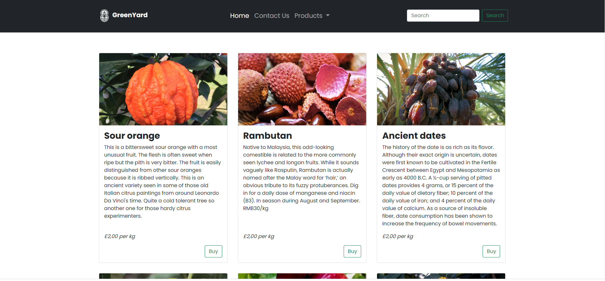
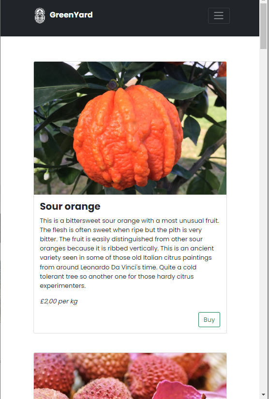

# Create a website fast with Bootstrap 5 - Bootcamp project

## Quick overview

This is a sample of a responsive website I coded using HTML, CSS and Bootstrap 5.
The website layouts adapts to different screen sizes.
When the cursor hovers over images, cards and buttons, dimensions or colours change.

## Usage
To see how the website looks, just click on the index.html file.
Below are some screenshots:

 
 
